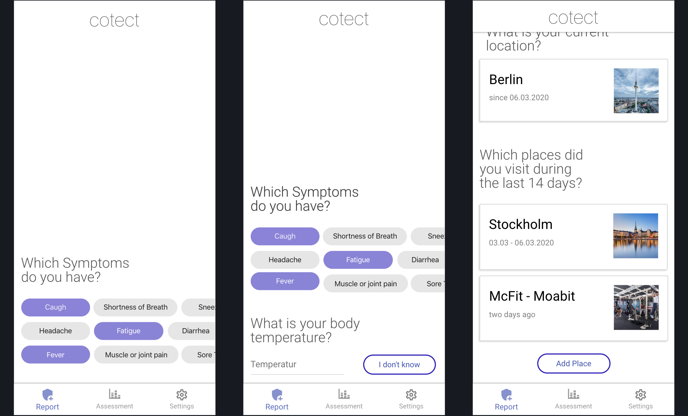
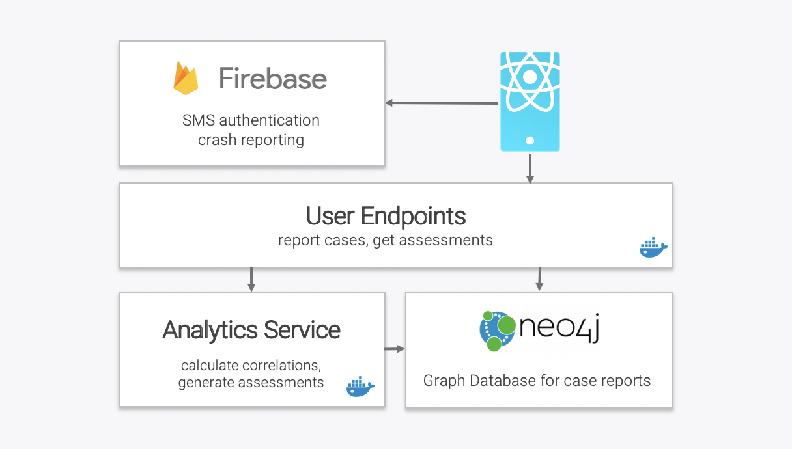
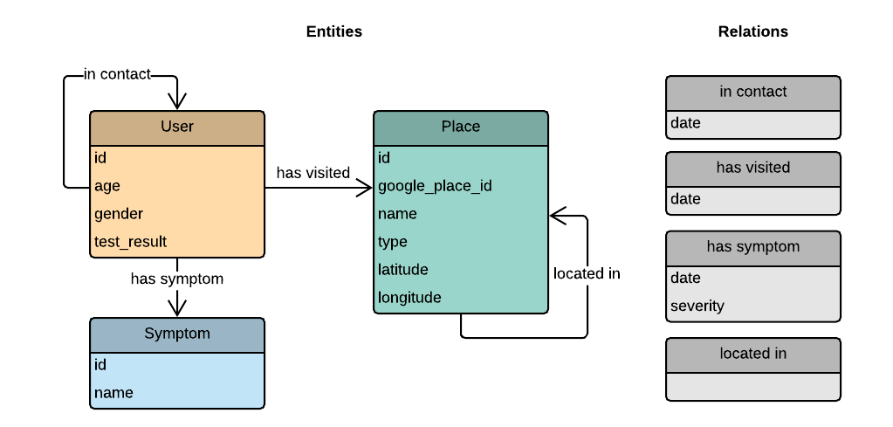
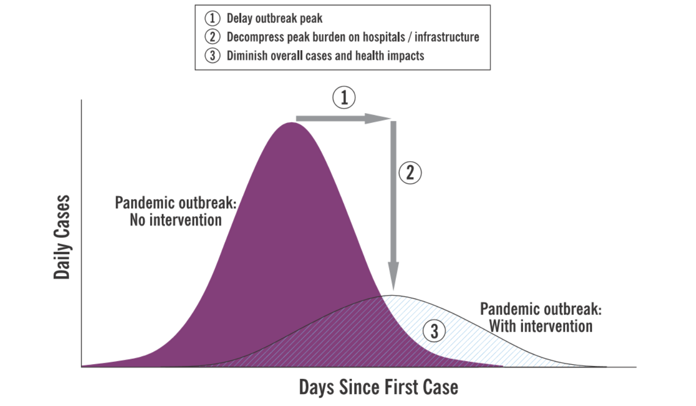

<h1 align="center">
    <a href="https://github.com/cotect/cotect" title="Cotect Home">
     </a>
    <br>
</h1>

<p align="center">
    <strong>Crowd-sourced COVID-19 reporting and assessment system.</strong>
</p>

<p align="center">
    <a href="https://github.com/cotect/cotect/commits/" title="Last Commit"></a>
    <a href="https://github.com/cotect/cotect/issues" title="Open Issues"></a>
    <a href="https://github.com/cotect/cotect/blob/master/LICENSE" title="Cotect License"></a>
    <a href="https://join.slack.com/t/cotectworkspace/shared_invite/zt-cv1ycjh2-qyu2C01IjEQOyPwtsajOIg" title="Chat on Slack"></a>
    <a href="https://twitter.com/cotectapp" title="Cotect on Twitter"></a>
</p>

<p align="center">
  <a href="#getting-started">Getting Started</a> •
  <a href="#concept">Concept</a> •
  <a href="#architecture">Architecture</a> •
  <a href="#support">Support</a> •
  <a href="https://github.com/cotect/cotect/issues/new?labels=bug&template=01_bug-report.md">Report a Bug</a> •
  <a href="#contribution">Contribution</a>
</p>



## Highlights

<details>
<summary><b>🤳 Anonymized reporting</b></summary>
<br>
Cotect allows anyone to anonymously report their symptoms with relevant meta-information such as visited places or contacts. The user can update their case at any time to keep track of changing symptoms, new contacts, or place visits. Cotect combines this data without storing any personally identifiable information. The user has full control over what information is reported and can delete this data at any time.
</details>
<details>
<summary><b>🚦 Personal risk assessments</b></summary>
<br>
By analyzing statistical correlations in the collected data, users will get personal risk assessments (e.g., likelihood of infection) based on their case reports. This includes Users, especially in the high-risk group, will also be able to get real-time information on the risk of visiting selected places (e.g., city, workplace, school). With this situation probably going on for months, a tool to get a data-driven risk assessment might be helpful for many.
</details>
<details>
<summary><b>📉 Support containment & mitigation</b></summary>
<br>
We are committed to support public institutions with containment and mitigation efforts. Our anonymized case dataset will be made accessible to research facilities and public institutions for discovering unknown infection chains and assist with data-informed decisions like closing places or canceling events. We are also ready to cooperate with health institutions to implement features within cotect to smoothen the testing process (e.g., find testing sites, enrollment, digital waiting list).
</details> 
<details>
<summary><b>🔐 Priority on data privacy</b></summary>
<br>
The cotect project aims to provide the highest level of data privacy while still allowing sophisticated data analytics. Cotect is fully GDPR compliant and allows single-click data export and deletion. All data traffic is fully encrypted, and data is stored with the highest level of security. The only purpose of data collection is to help with containment and mitigation. Once this goal is fulfilled, all data will be deleted.
</details> 
<details>
<summary><b>🎛 Scalable infrastructure</b></summary>
<br>
The cotect architecture allows scalability to millions of users. It is built with components of the GCP platform, including Kubernetes, Firebase, and the Places API, which are designed for high performance and unlimited scalability.
</details>
<details>
<summary><b>📊 Sophisticated data analytics</b></summary>
<br>
Our data collection, infrastructure, and data model are optimized for applying statistical- and machine-learning methods to instantly detect chains of infection. The data collected via contact and location report capabilities are processed into a highly-connected graph structure, which also provides a lot of flexibility to integrate new information. The authorization and data verification capabilities minimize misuse and ensure the collection of high-quality data.
</details>
<details>
<summary><b>🌐 Open-source & non-profit</b></summary>
<br>
We are committed to keep the cotect project fully open-source and non-profit with the highest level of transparency. This project is set-up to allow broad collaboration between different companies, organizations, and institutions to support with development and provide funding for cloud expenses.
</details>

<br>

## Getting Started

_Coming soon..._

<br>

## Architecture



The initial selection of technologies includes:

- React Native for cross-platform app development (Android & iOS).
- Neo4j for storing the case reports in a graph format.
- Docker and Kubernetes for service deployment.
- Firebase for SMS authentication and crash reporting.

The main aspects of this selection of technologies are the speed of development, simplicity, and scalability. We are still in evaluation of which cloud platform we want to use (GCP, AWS, Azure). However, since Firebase is part of GCP, this might be the best choice for now.

### Case Report

All metadata are strictly optional. The user can decide which level of information he is willing to provide.

- Current location (city-level)
- Basic demographic metadata: age & gender
- Selection of symptoms from a collection of flu/corona-symptoms (e.g., fever, cough, headache)
    - enrich with additional metadata based on selected symptoms (e.g., fever → body temperature)
- Places visited during the last 14 days (e.g., cities, workplaces, cafes, church, clubs, schools) + date of visit.
- Test result for coronavirus, in case a test was performed.
- People you had at-least 15 minutes contact during the last 14 days + timestamp of last contact. Select based on phone contacts → match via phone number.

After reporting the initial case information, the user can always update this information as well. A case report update will enable the user to provide changes in symptoms or additional visited places / contacted persons.

### Data Model

The collected case data will be stored within a graph strcture based on the follwing data model:



### Authentication

We will use only a phone number based authentication (similar to WhatsApp) to enable a certain level of anonymity while still keeping misuse and spam low. Therefore, we decided to use the [phone authentication](https://invertase.io/oss/react-native-firebase/v6/auth/phone-auth) feature of Firebase. After the user has verified the phone number, the app will use the [Firebase ID Token](https://firebase.google.com/docs/reference/js/firebase.User#getidtoken) as authentication method for all requests to the user endpoints by using the [verify-id-token](https://firebase.google.com/docs/auth/admin/verify-id-tokens) method. The user ID which is used within the database (case graph) will be based on the hash of the [normalized](https://pypi.org/project/phonenumbers/) phone number (which can be retrieved from the token) that is combined and hashed with a secret:

```
user_id = hash(hash(normalize_number(user.phone_numer)), secret)
```

### Data Anonymization

All data within the case graph will be anonymized to the most reasonable degree. Unfortunately, it can not be completly ruled out that a user can be theoretically identified based on the provided place visits and demographic data. However, the user endpoints, which are secured via the phone-based authentication, will only provide very limited access to this data. Furthermore, we will not store the users phone numbers (or any other directly identifiable information) within our database.

### Anonymous Contact Tracing

For the case report, the user is able to select any number of contacts from the phones contact list (via the phone number). However, no identifiable information of those selected contacts will be exposed to the backend. Instead, the client will [normalize](https://www.npmjs.com/package/libphonenumber-js) the contact's phone number and send it as a hashed format to the backend. Within the backend, the user id of the contact can be constructed by hashing it with the secret:

```
contact_id = hash(hashed_contact_number, secret)
```

### Assessment Report

*TBD*

### Further Improvements

- Integrate regular push notifications to remind users to update their case data.
- Integrate push notifications for health risk alerts in your area.
- Integrate publicly available data or internal data from public institutions to enrich our dataset.
- Provide integration options to public institutions to enable efficient data collection with hotlines.
- Evaluate optional Bluetooth or GPS tracking for automated contact tracing.
- Incorporate newest Study results on COVID-19 (e.g.,  symptoms,  ways of infection, risk-factors)
- Add events visited during the last 14 days to the case data (probably not necessary since any event is mostly bound to a specific location/place)
- add start-date and end-date to realtion attributes and option to provide specific times.
- Evaluate to use GPS or IP to get user location.
- Add easy way to share report to contacts via whatsapp.

<br>

## Concept

<details>
<summary><b>Problem Statement</b> (click to expand...)</summary>
<br>
<ul>
<li><b>Hard to get tested:</b> Germany has a theoretical capacity of 12k tests a day, but logistical challenges and limits on medical personal will make it unlikely to have anyone with flu-like symptoms tested in a timely manner. Based on the current scientific state, fast a reliable detection capability is one of the best ways to slow down the virus infections.</li>
<li><b>Missing data collection:</b> Within Germany, there is no easy way for individuals to report flu-like symptoms and related information to allow meaningful statistical inference on undetected infection chains. Furthermore, centralized data collection of official hotlines or doctor's offices is very limited or non-existent.</li>
<li><b>Hard to keep contacts informed:</b> In case of a suspected infection, it's emotionally stressful to reach out to family and friends to provide this potentially valuable information. For other contacts, you might not even be able to inform them. An anonymized way of reporting symptoms and meta-information would allow anybody to keep potential contacts informed.</li>
<li><b>Unable to make data-informed decisions:</b> If Covid-19 cannot be contained, we will most likely have to deal with it for several months. Of course, a longterm lockdown can not be sustained and public life will go on. A tool that can provide "real-time" predictions about the risk of visiting certain places can be invaluable for many people, especially for high-risk groups.</li>
</ul>
</details>

<details>
<summary><b>Solution</b> (click to expand...)</summary>
<br>
Cotect allows anyone to anonymously report their flu-symptoms with relevant meta-information such as visited places or events. By analyzing statistical correlations in the collected data, users will get personal risk assessments (e.g., likelihood of Covid-19 infection) based on their reports. Users, especially in the high-risk group, will also be able to get real-time information on the risk of visiting selected places (e.g., city, workplace, school). The full anonymized dataset will be made accessible to research facilities and public institutions for discovering unknown infection chains and assist with data-informed decisions on closing places or canceling events.

The initial goal at the start of the project will be to help with containment and slow-down of infections. At a later stage of the project, we will put the main focus on helping to protect the high-risk groups (elderly, people with pre-existing conditions). 


</details>

<details>
<summary><b>Challenges</b> (click to expand...)</summary>
<br>
<ul>
<li><b>Scalability:</b> The app will need to have a high number of users to be useful and provide high-quality statistical assessments. This puts on technical challenges (needs to scale to thousands - maybe millions - of users) as well as challenges on the distribution (how to reach people? how to grow the app?).</li>
<li><b>Statistical Quality:</b> At the moment, we do not have any conclusive information on what saturation (count of reports) we need to draw any statistical conclusion for risk assessments. This will be an active workstream to collect scientific evidence. Furthermore, we will need to try various data science and machine learning methods to build up a stable analysis pipeline.</li>
<li><b>Data Privacy:</b> People in Germany are generally quite concerned about data collection, especially if it involves medical data. We hope that a transparent project organization, open-source development, a certain level of anonymity, a well-defined data strategy, and a clear message never to have any commercial intent will provide a high level of trust. Furthermore, in times of crisis, people might prioritize the positive aspects that can be achieved by having a centralized data collection over their concerns on data privacy. Also, the app and data collection will be fully GDPR compliant.</li>
<li><b>Misuse:</b> It might turn out to be a challenge to keep the data as clean and trustworthy as possible. People might try misuse the app and report wrong or misleading information, which in turn will screw up any statistical inference. Phone-number based authentication might keep the number of under maligned accounts under control.</li>
<li><b>Urgency & Speed:</b> Because of the quickly evolving situation, the project requires rapid development, pragmatic decisions, and out-of-the-box thinking while still keeping the quality, security, and scalability of the technology. The project needs to be organized in a way additional members can be added at any moment to speed up development.</li>
</ul>
</details>

<details>
<summary><b>Organization & Execution</b> (click to expand...)</summary>
<br>
<ul>
<li>Driven by SAP developers but fully open-source and open for public contributions.</li>
<li>This project will have zero commercial intent. The software will be fully open-source. Collected data will be accessible by public institutions and research facilities. Data will be deleted on request or once the project has fulfilled its goal.</li>
<li>We plan to roll out the app city-by-city, depending on which city is facing the most significant issues. Our first focus will be cities within Germany and other European countries.</li>
<li>Pragmatic and agile decisions with focus on building something useful. Full focus on developing and rolling out scalable and stable software in the fastest possible way.</li>
<li>We will slow down or stop this project in case COVID-19 can be contained or we get indications that the situation will not require this kind of software.</li>
</ul>
</details>

<br>

## Support

The cotect repository is maintained by [Lukas Masuch](https://twitter.com/LukasMasuch)
and [Benjamin Räthlein](https://twitter.com/raethlein). Please understand that we won't be able
to provide individual support via email. We also believe that help is much more
valuable if it's shared publicly so that more people can benefit from it.

| Type                     | Channel                                              |
| ------------------------ | ------------------------------------------------------ |
| 🚨 **Bug Reports**       | <a href="https://github.com/cotect/cotect/issues?utf8=%E2%9C%93&q=is%3Aopen+is%3Aissue+label%3Abug+sort%3Areactions-%2B1-desc+" title="Open Bug Report"></a>                                 |
| 🎁 **Feature Requests**  | <a href="https://github.com/cotect/cotect/issues?q=is%3Aopen+is%3Aissue+label%3Afeature-request+sort%3Areactions-%2B1-desc" title="Open Feature Request"></a>                                 |
| 👩‍💻 **Usage Questions**   |  <a href="https://join.slack.com/t/cotectworkspace/shared_invite/zt-cv1ycjh2-qyu2C01IjEQOyPwtsajOIg" title="Chat on Slack"></a> <a href="https://twitter.com/cotectapp" title="Cotect on Twitter"></a> |
| 🗯 **General Discussion** | <a href="https://join.slack.com/t/cotectworkspace/shared_invite/zt-cv1ycjh2-qyu2C01IjEQOyPwtsajOIg" title="Chat on Slack"></a> <a href="https://twitter.com/cotectapp" title="Cotect on Twitter"></a>                  |

<br>

## Contributors

[](https://sourcerer.io/fame/LukasMasuch/cotect/cotect/links/0)[](https://sourcerer.io/fame/LukasMasuch/cotect/cotect/links/1)[](https://sourcerer.io/fame/LukasMasuch/cotect/cotect/links/2)[](https://sourcerer.io/fame/LukasMasuch/cotect/cotect/links/3)[](https://sourcerer.io/fame/LukasMasuch/cotect/cotect/links/4)[](https://sourcerer.io/fame/LukasMasuch/cotect/cotect/links/5)[](https://sourcerer.io/fame/LukasMasuch/cotect/cotect/links/6)[](https://sourcerer.io/fame/LukasMasuch/cotect/cotect/links/7)

<br>

## Contribution

- Pull requests are encouraged and always welcome. Read [`CONTRIBUTING.md`](https://github.com/cotect/cotect/tree/master/CONTRIBUTING.md) and check out [help-wanted](https://github.com/cotect/cotect/issues?utf8=%E2%9C%93&q=is%3Aopen+is%3Aissue+label%3A"help+wanted"+sort%3Areactions-%2B1-desc+) issues.
- Submit Github issues for any [feature enhancements](https://github.com/cotect/cotect/issues/new?assignees=&labels=feature-request&template=02_feature-request.md&title=), [bugs](https://github.com/cotect/cotect/issues/new?assignees=&labels=bug&template=01_bug-report.md&title=), or [documentation](https://github.com/cotect/cotect/issues/new?assignees=&labels=enhancement%2C+docs&template=03_documentation.md&title=) problems. 
- By participating in this project, you agree to abide by its [Code of Conduct](https://github.com/cotect/cotect/tree/master/CODE_OF_CONDUCT.md).

---

Licensed **MIT**. Created and maintained with ❤️ by a team of friends and colleagues from Germany.
